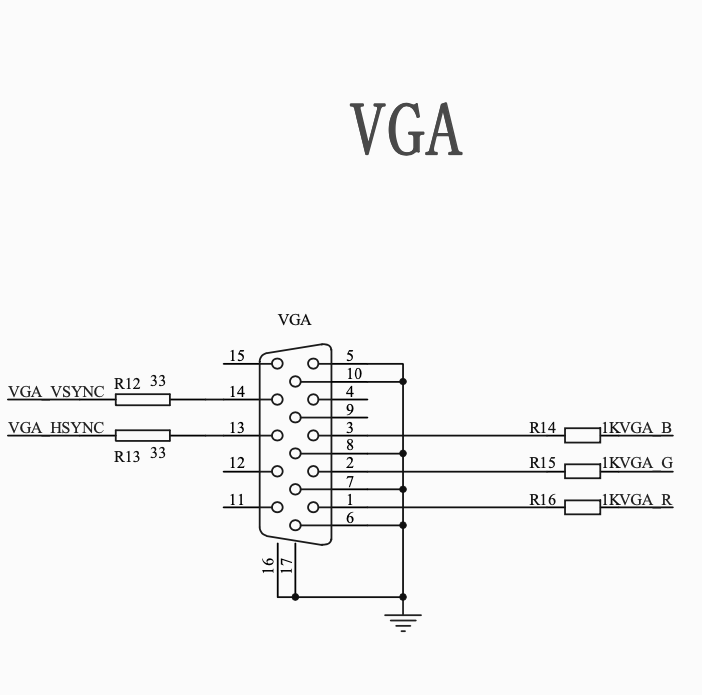
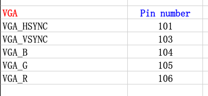

# Example: VGA from *Peripheral control 14 VGA* Experimental code.

The video below shows the VGA sample code working on the board.  


The onboard VGA output only has 1 bit per color, so there are only a total of eight colors available.

The schematic for the onboard VGA is:



and the associated pins are:



The Verilog code from the example files is below, including Chinese character set comments that don't appear to translate well on my US system.


```
/*—ßœ∞VGAœ‘ æ‘≠¿Ì,œ‘ æ≤ Ãı–≈∫≈°£
¡¨Ω”ø™∑¢∞µƒVGAΩ”ø⁄∫ÕµÁƒ‘œ‘ æ∆˜£¨
≤¶¬Îø™πÿ1£¨2Õ¨ ±≤ª…œ≤¶£¨  ‘Úœ‘ æ8…´∑Ω∏Ò£®∆Â≈Ã∏Ò£©
≤¶¬Îø™πÿ1Ãß…œ»•£¨2≤ª…œ≤¶£¨‘Úœ‘ æ±‰ªª∑ΩœÚµƒ8…´∑Ω∏Ò£®∆Â≈Ã∏Ò£©
≤¶¬Îø™πÿ1£¨2Õ¨ ±≤¶…œON£¨‘Úœ‘ æ8…´∫·Ãı
≤¶¬Îø™πÿ1≤ª≤¶£¨2≤¶…œON£¨‘Úœ‘ æ8…´ ˙Ãı
*/
module VGA(
   clock,
   switch,
   disp_RGB,
   hsync,
   vsync
);
input  clock;     //œµÕ≥ ‰»Î ±÷” 50MHz
input  [1:0]switch;
output [2:0]disp_RGB;    //VGA ˝æ› ‰≥ˆ
output  hsync;     //VGA––Õ¨≤Ω–≈∫≈
output  vsync;     //VGA≥°Õ¨≤Ω–≈∫≈

reg [9:0] hcount;     //VGA––…®√˺∆ ˝∆˜
reg [9:0]   vcount;     //VGA≥°…®√˺∆ ˝∆˜
reg [2:0]   data;
reg [2:0]  h_dat;
reg [2:0]   v_dat;

//reg [9:0]   timer;

reg   flag;
wire  hcount_ov;
wire  vcount_ov;
wire  dat_act;
wire  hsync;
wire   vsync;
reg  vga_clk;
//VGA––°¢≥°…®√Ë ±–Ú≤Œ ˝±Ì
parameter hsync_end   = 10'd95,
   hdat_begin  = 10'd143,
   hdat_end  = 10'd783,
   hpixel_end  = 10'd799,
   vsync_end  = 10'd1,
   vdat_begin  = 10'd34,
   vdat_end  = 10'd514,
   vline_end  = 10'd524;


always @(posedge clock)
begin
 vga_clk = ~vga_clk;
end

//************************VGA«˝∂Ø≤ø∑÷******************************* 
//––…®√Ë     
always @(posedge vga_clk)
begin
 if (hcount_ov)
  hcount <= 10'd0;
 else
  hcount <= hcount + 10'd1;
end
assign hcount_ov = (hcount == hpixel_end);
//≥°…®√Ë
always @(posedge vga_clk)
begin
 if (hcount_ov)
 begin
  if (vcount_ov)
   vcount <= 10'd0;
  else
   vcount <= vcount + 10'd1;
 end
end
assign  vcount_ov = (vcount == vline_end);
// ˝æ›°¢Õ¨≤Ω–≈∫≈ ‰
assign dat_act =    ((hcount >= hdat_begin) && (hcount < hdat_end))
     && ((vcount >= vdat_begin) && (vcount < vdat_end));
assign hsync = (hcount > hsync_end);
assign vsync = (vcount > vsync_end);
assign disp_RGB = (dat_act) ?  data : 3'h00;       

//************************œ‘ æ ˝æ›¥¶¿Ì≤ø∑÷******************************* 
//Õº∆¨œ‘ æ—” ±º∆ ˝∆˜
/*always @(posedge vga_clk)
begin
 flag <= vcount_ov;
 if(vcount_ov && ~flag)
  timer <= timer + 1'b1;
end
*/

always @(posedge vga_clk)
begin
 case(switch[1:0])
  2'd0: data <= h_dat;      //—°‘Ò∫·≤ Ãı
  2'd1: data <= v_dat;      //—°‘Ò ˙≤ Ãı
  2'd2: data <= (v_dat ^ h_dat); //≤˙…˙∆Â≈Ã∏Ò
  2'd3: data <= (v_dat ~^ h_dat); //≤˙…˙∆Â≈Ã∏Ò
 endcase
end

always @(posedge vga_clk)  //≤˙…˙ ˙≤ Ãı
begin
 if(hcount < 223)
  v_dat <= 3'h7;      //∞◊   
 else if(hcount < 303)
  v_dat <= 3'h6;   //ª∆
 else if(hcount < 383)
  v_dat <= 3'h5;   //«‡
 else if(hcount < 463)
  v_dat <= 3'h4;    //¬Ã
 else if(hcount < 543)
  v_dat <= 3'h3;   //◊œ
 else if(hcount < 623)
  v_dat <= 3'h2;   //∫Ï
 else if(hcount < 703)
  v_dat <= 3'h1;   //¿∂
 else 
  v_dat <= 3'h0;   //∫⁄
end

always @(posedge vga_clk)  //≤˙…˙∫·≤ Ãı
begin
 if(vcount < 94)
  h_dat <= 3'h7;        //∞◊
 else if(vcount < 154)
  h_dat <= 3'h6;   //ª∆
 else if(vcount < 214)
  h_dat <= 3'h5;   //«‡
 else if(vcount < 274)
  h_dat <= 3'h4;    //¬Ã
 else if(vcount < 334)
  h_dat <= 3'h3;   //◊œ
 else if(vcount < 394)
  h_dat <= 3'h2;   //∫Ï
 else if(vcount < 454)
  h_dat <= 3'h1;   //¿∂
 else 
  h_dat <= 3'h0;   //∫⁄
end

endmodule

```

