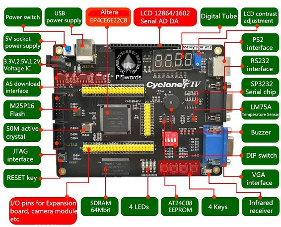

# CET466 Digital Logic

This repository is for the [CCSU Fall 2020 CET466 Digital Logic course](https://ccsu.smartcatalogiq.com/en/current/Undergraduate-Graduate-Catalog/All-Courses/CET-Computer-Electronics-Technology/400/CET-466).

The course will be using the RZ-EasyFPGA board which is a nice, inexpensive board that uses a Cyclone IV chip.

This image shows some of the features of the board.

The pinouts are shown below.

## Some Links

[Most of this repository is a downloaded and unrarred version of the files here.](http://fpga.redliquid.pl/) I figured a GitHub repository might be more accessible.

[The original manufacturer of the board seems to be here.](http://www.rzrd.net/product/?79_502.html)

I found the pinout image above on [Hey There Buddo!](https://www.philipzucker.com/simple-fpga-stuff/).

This page says how to run [Quartus on a Mac](https://ezcontents.org/altera-quartus-mac-osx), however, I was not successful in getting it to be able to program the board using the USB blaster. It does all the compulation etc. fine, just doesn't blow the board (either JTAG or AS).

This page shows quite detailed instructions about getting the [board running under Windows.](https://gojimmypi.blogspot.com/2018/02/first-fpga-test-drive-with-altera.html). Note that this page uses Verilog, but the course will be taught using VHDL.

There are some other GitHub repositories around that reference the RZ EasyFPGA board. [Here's one that I cloned](https://gist.github.com/kootsoop/9a52aca63f8885c351363b1a7407282b)

[To download Quartus Prime v20.1, go to the Intel site and download it. Be warned: it's LARGE.](https://fpgasoftware.intel.com/20.1/?edition=lite)

To clone this repository on Windows, you need to have [long file names enabled](https://stackoverflow.com/questions/22575662/filename-too-long-in-git-for-windows) by running `git config --system core.longpaths true`. Otherwise `git` will give an error about `Clone succeeded but checkout failed.`

Some more information, including the marked up image showing the board features above is available from [here](http://piswords.com/ep4ce6e22c8n.html).

The [NAND2Tetris text book](https://www.nand2tetris.org/) was the inspiration [for this repository](https://gitlab.com/x653/nand2tetris-fpga/)

## Some Videos

There are several videos on YouTube using the board, though most are not in English:

- [Sample blinking the LEDs](https://www.youtube.com/watch?v=sspek_3XA6A) This YouTuber has several other videos about the board.
- [This doesn't use our board, but it's a good first step in how to use Quartus](https://www.youtube.com/watch?v=RAD9Y8JGY9s)
- [This one uses VHDL and is a good start-up demonstration](https://www.youtube.com/watch?v=t72x_zZdDPs)

## CET466 Syllabus

Despite what I've written in the official syllabus, the main points of CET466 are the following applied to programming FPGAs in VHDL to make combinatorial and sequential logic circuits:

- **Plan** : Use what you learned in [CET363](https://ccsu.smartcatalogiq.com/en/current/Undergraduate-Graduate-Catalog/All-Courses/CET-Computer-Electronics-Technology/300/CET-363) to capture and refine a paper design of a logic circuit.
- **Do** : Implement the logic circuit paper design in VHDL.
- **Review** : Use [Quartus Prime Lite](https://www.intel.com/content/www/us/en/products/details/fpga/development-tools/quartus-prime.html) to write a test harness that partially or exhaustively tests that the implementation solves the design problem.

### Plan : What is in CET363?

The catalog description of CET363 is:

> _Principles and applications of digital circuits, number systems, Boolean Algebra, combinatorial and sequential logic circuits, arithmetic circuits, and MSI logic circuits. Laboratory experiments focus on circuit building and troubleshooting using TTL integrated circuits._

So the key points are:

1.  The circuits we want to work with are digital circuits. So you need to understand binary numbers and the difference between [active low and active high](https://learn.sparkfun.com/tutorials/logic-levels/active-low-and-active-high).
1.  The number systems we deal with are binary, octal, decimal, and hexadecimal. You need to be able to convert between all of them.
1.  The problems we deal with can generally be reduced to Boolean algebra. That means you need to understand how to write and manipulate expressions using Boolean (binary) variables. Know [the laws of Boolean algebra](https://www.electronics-tutorials.ws/boolean/bool_6.html), especially De Morgan's Law.
1.  [Know what a combinatorial circuit is.](https://dept-info.labri.fr/~strandh/Teaching/AMP/Common/Strandh-Tutorial/combinatorial.html)
1.  [Know what a sequential circuit is.](https://www.elprocus.com/different-types-of-sequential-circuits)
1.  [Know what a full adder and a half-adder do and how they work.](https://www.geeksforgeeks.org/difference-between-half-adder-and-full-adder/)
1.  Know the different sorts of logic gates available: AND, OR, NOT, NAND, NOR, buffer, SR F/F, JK F/F, T F/F, D F/F, latches, decoders, encoders, LUTs, etc.

### Do : Do the design in VHDL

This means you need to understand [all the different language constructs in VHDL.](PDFs/VHDL-All-Slides.pdf)

The way to do this gradually is to build up your knowledge over a series of labs:

- Design a half-adder.
- Make a full-adder.
- Make a four-bit adder.
- Fix the four-bit adder's glitches.
- Make an up/down counter.
- Make a baseball score counter.
- Take on a larger group project.

The key thing to remember about VHDL is that, unless the code is within a `process()` block, EVERYTHING HAPPENS AT ONCE.

**VHDL code is not sequential.**

Inside a `process()` block, code is sequential. To be able to use `if` statements, they need to be inside a `process()` block.

### Review : Add a testbench to your Quartus project

To run a test, you need to run the ModelSim-Altera FREE test software. This comes with Quartus Prime Lite and should already be installed. See the second video below for a run through of what is required.

### Videos

1. [This video shows how to setup the boards](https://www.youtube.com/watch?v=KerOScn4eXo)
1. [This video shows how to add a test bench](https://youtu.be/L9TBO1pDb4o)
1. [This video shows how to run Quartus on the Citrix server](https://youtu.be/z4YBU2qMfCM)
1. [Full video playlist of the Fall 2021 CET466 lectures + additions](https://www.youtube.com/playlist?list=PLwTKofaON8MdpCwUfrVzTDJRikl_dtnN7)
